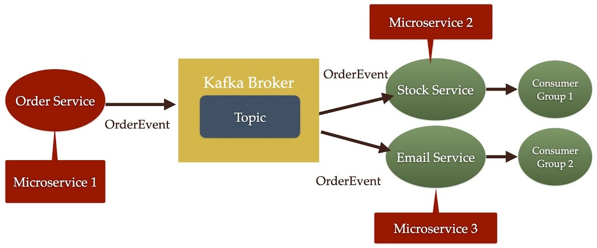

## Реализация микросервисного проекта, с иcпользованием Kafka 

Структура проекта следующая:





- Для запуска `zookeeper` наберите в командной строке (`cmd` запущен из папки со всеми файлами `kafka`):
```
.\bin\windows\zookeeper-server-start.bat .\config\zookeeper.properties
```
- Для запуска `kafka server` наберите в командной строке (`cmd` запущен из папки со всеми файлами `kafka`):
```
.\bin\windows\kafka-server-start.bat .\config\server.properties
```

OrderEvent пересылается в брокер Kafka в формате JSON

Stock и Email - с разными group-id
